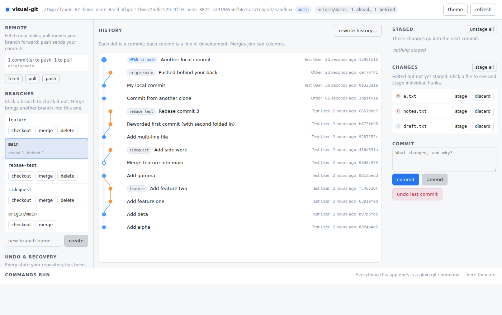
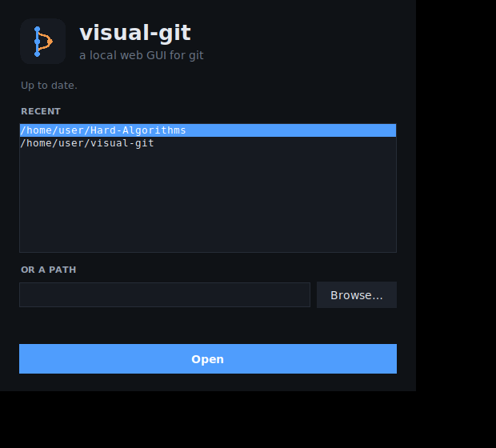
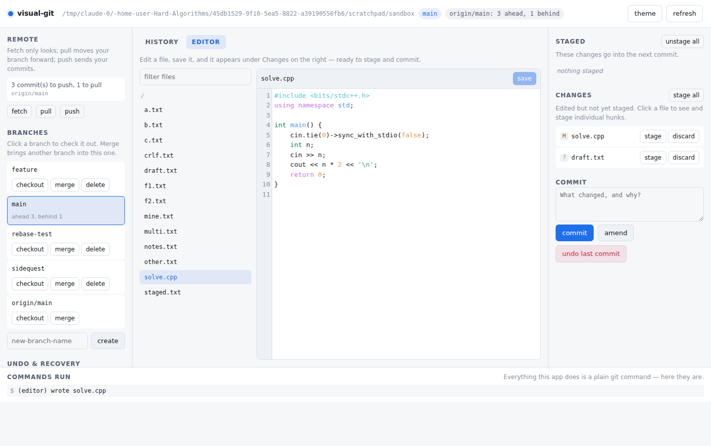

# visual-git


A local web GUI for git. Every button runs a plain git command and shows you
which one, so you can see what you are actually doing instead of memorising it.

Git's data model is excellent; its command line is not. This is a thin,
readable layer over the commands — not a replacement for them, and not a
different model of how git works.



## Running it

Nothing to install: Python 3.8+ and git. CodeMirror is vendored under
`static/vendor/` (MIT licensed), so nothing is fetched at runtime and the app
works offline.

```sh
python3 server.py /path/to/repo     # macOS / Linux
py server.py C:\path\to\repo        # Windows
```

The repository is just that argument, so point it at any repo you like — pass
any folder inside one and it finds the root. One repo per server; the port
steps forward if the one asked for is busy. `--no-browser` skips opening a
window. Stop it with ctrl-c.

The UI opens in a window of its own rather than a browser tab: if Chrome or
Edge is installed it is launched with `--app`, which drops the tab strip and
address bar and gives the app its own taskbar entry. Nothing is installed to
make that work — it is the browser you already have, asked for a different
kind of window. With neither available it falls back to your default browser,
where it is an ordinary tab.

### The launcher

On Windows, double-click **`visual-git.bat`** instead. It updates itself with
`git pull`, lists the repositories you opened before, and starts the server
for whichever you pick — no terminal involved.



The list lives in `~/.visual-git-recent.json`, outside the repository, and
paths that no longer exist drop off it. Once a server is running the window
shows its address and keeps it alive; closing the window stops it.

If tkinter is missing the launcher falls back to the same flow as a prompt in
the terminal; `--console` forces that on purpose.

To build it into a single `.exe` instead, on the machine that will run it:

```sh
pip install pyinstaller
pyinstaller --onefile --windowed --name visual-git --icon visual-git.ico --add-data "static;static" --hidden-import server launcher.py
```

Put the resulting `dist/visual-git.exe` **in the visual-git folder** — it runs
`git pull` in whichever directory it sits in. (On macOS or Linux the
`--add-data` separator is `:` rather than `;`.)

## What it does

**Staging and committing.** Stage and unstage whole files, or click a file to
see its diff and stage one hunk at a time. Commit, amend, or undo the last
commit while keeping its changes staged.

**Stash.** Set the working tree aside without committing and bring it back
later. Untracked files go in too, so stashing does not appear to leave half
your work behind.

**Undo and recovery.** The reflog is shown as a plain list of every state the
repository has been in, including ones no branch points at any more, with a
one-click restore. This is how you recover from a bad reset or rebase.

**History rewriting.** A visual interactive rebase: set each commit to pick,
reword, squash, fixup or drop, reorder them, and run it. The todo list and any
new commit messages are fed to git through `GIT_SEQUENCE_EDITOR` and
`GIT_EDITOR`, so nothing opens an editor.

**Branches and merges.** The commit graph is drawn from the parent links, one
column per line of development, so merges and divergence are visible. Click a
commit to see what it changed. The search box filters by message, author or
hash — while filtering the graph is hidden rather than drawn wrong, since lane
assignment only means anything over a full parent chain. Branches
list their ahead/behind counts against their upstream. Merge conflicts surface
the conflicted files and an abort button.

**Worktrees.** List the repository's worktrees, add one for a branch, switch
the app to it without restarting, and remove one you are done with. A new
worktree is created as a sibling of the main one, named `<repo>-<branch>` — the
path is derived by the server rather than typed in the browser, so the only
folder this can create directories in is the one holding your repository.
Switching accepts only a path git itself lists as a worktree of the open
repository.

**Remotes.** Fetch (`--all --prune`), pull and push, with how far ahead or
behind your branch is shown before you act. Pull is `--ff-only`: if the
histories have diverged it fails and changes nothing rather than quietly
writing a merge commit. Push offers `--force-with-lease` only after a push is
rejected, behind a confirmation — it refuses if the remote moved since your
last fetch.

Remote commands run with `GIT_TERMINAL_PROMPT=0`, so they cannot stop to ask
for a password: your credentials need to already work without prompting (an
SSH key, or a credential helper). Otherwise the command fails with a visible
error instead of hanging.

**Editing.** An Editor tab with a collapsible tree of every file git tracks
(plus untracked ones it isn't ignoring) and a CodeMirror pane beside it.
Folders start closed, so a repo opens showing its shape rather than every file
in it, and the filter box searches the whole tree. Files sort by extension
first, so files of a kind sit together. Brackets and quotes close themselves.
Files can be
created, renamed and deleted: tracked ones go through `git mv` and `git rm` so
the change is staged, untracked ones are moved or removed directly. Save
with the button or ctrl-S; the file then shows up under Changes, ready to
stage and commit without leaving the page. Existing line endings are kept, so
saving a CRLF file doesn't turn every line into a diff.



The `.git` directory is not readable or writable through the editor — editing
hooks or config from a web page is a long way round to running arbitrary code.

**Interface.** English, 한국어 and 日本語, picked from the top bar and
remembered per browser (it starts on your browser's language if that is one of
them). Six themes — dark, light, Nord, Solarized, Dracula, Gruvbox — which
recolour the editor's syntax highlighting along with everything else. The
command log has a clear button.

## What it does not do

- Hunk-level staging, not line-level.
- The editor opens UTF-8 text files under 2 MB. No binaries.
- The rebase editor covers the run of ordinary commits below `HEAD`, up to
  eight of them. It stops at the first merge commit, because a plain
  interactive rebase cannot replay one.
- Conflicts are surfaced, not resolved — edit the files yourself, then stage.

## Notes on safety

Destructive actions (discarding changes, `reset --hard`, deleting a branch,
rebasing) require confirmation and tell you whether the reflog can get the
state back.

The server binds to `127.0.0.1` only, and every API call requires both a token
and a custom header, so a web page you happen to have open elsewhere cannot
drive it. The token is kept in `~/.visual-git-token`, readable only by you, and
reused across runs so a window opened earlier keeps working; an address without
it gets a page saying so rather than the app. Git arguments are built server-side from a fixed set
of actions and passed as an argument list — the browser cannot name a git
subcommand, pass a flag, or reach a path outside the repository.

Treat it as a local development tool. It is not built to be exposed to a
network.

## License

MIT — see [LICENSE](LICENSE).

CodeMirror, under `static/vendor/codemirror/`, is also MIT and keeps its own
copyright; its licence sits beside it.
